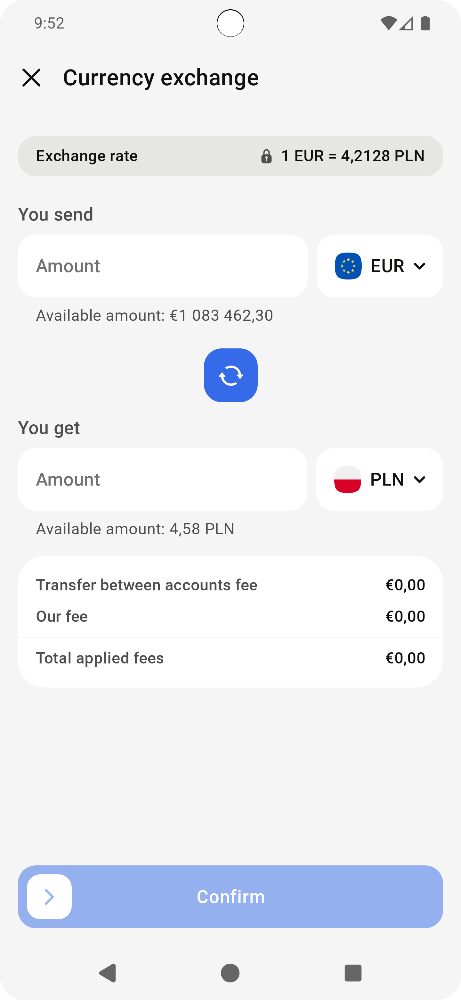

# Currency Exchange (CEX) Application

This Android application simulates currency exchange operations between accounts with different currencies. It uses a fake network data source to mimic real API calls for testing and development purposes.

## Key Classes

### Interface
- **CurrencyExchangeNetworkDataSource**: Defines the contract for currency exchange operations with methods for creating offers and confirming transactions.

### Implementation
- **FakeCurrencyExchangeNetworkDataSource**: Implements the interface to simulate network requests with artificial delays and random exchange rates.

### Data Models
- **Account**: Represents a user account with ID, currency code, and available balance.
- **CurrencyCode**: Enum of supported currencies (USD, EUR).
- **CurrencyExchangeOffer**: Contains exchange details including rates, fees, and amounts.
- **CurrencyExchangeOfferResponse**: Response wrapper for offer creation.
- **CurrencyExchangeConfirmResponse**: Response wrapper for transaction confirmation with success status.

## Core Functionality

1. **Creating currency exchange offers**: Calculates exchange rates, fee, and conversion amounts between accounts.
2. **Confirming currency exchange transactions**: Processes the confirmation returns success or failure with a simple message.

## Requirements
1. **Create a caching mechanism**: If source account, target account and amount is the same return cached offer. Cache invalidates when user confirms or offer expires (5 minutes)
2. **Unit tests**: Write comprehensive unit tests for the repository implementation
3. **Coroutine Integration**:
   1. Ensure all asynchronous operations use Kotlin coroutines
   2. Implement proper exception handling with coroutines
   3. Use appropriate coroutine scopes and dispatchers
4. **Architecture Components**
   1. Create a ViewModel
   2. Implement LiveData or Flow to expose data to the UI
5. **User Interface**
   1. Do not create the actual UI but you can assume there will be a UI with following properties: 
   2. You can assume the screen is initialised with source and target account. 
   3. User can not change the accounts.
   4. Whenever amount change we need to create another offer with the new amount and update UI.
   5. Amount input updates should have 1 second debounce. Not every character change should trigger update.
   6. You can assume that exchange rate is valid for 5 minutes. Exchange rate should be updated every 5 minutes
   7. Amount input should not be edited during a network request
   8. If user enters an amount bigger than available amount. We should display an error and disable confirm button.
   9. If the amount is ZERO user can not confirm the offer